### ----------------------------------注:本人写的算法为MDPC---------------------------------

代码运行请使用[Main.m](./Main.m)

## 流形数据集的实验结果		

​		为验证MDPC算法的有效性，使用MDPC算法与IDPC-FA[^1]、DPCSA[^2]、FNDPC[^3]、FKNN-DPC[^4]、DPC算法[^5]对8个流形数据集[^6]及8个UCI数据集[^7]进行了对比实验，数据集的信息在表1和表2进行展示。其中IDPC-FA与DPCSA算法不需要进行设置参数在实验结果表中使用“-”表示，其余算法均在实验过程中调参得到的最优结果。其中DPC算法参数在升序排列后的所有样本间的距离集合0.1%到5%之间选取，步长为0.1%。对聚类效果的评价指标为Adjusted Mutual Information(AMI)[^8]、Adjusted Rand Index(ARI)[^8]、Fowlkes-Mallows index(FMI)[^9]三个评价指标，指标值越接近1表示聚类结果越好。

​                                                                                   表1 流形数据集

| 数据集    | 样本数 | 维度 | 簇数 |
|-----------|--------|------|------|
| Circle    | 1897   | 2    | 3    |
| Cmc       | 1002   | 2    | 3    |
| Db        | 630    | 2    | 4    |
| Jain      | 373    | 2    | 2    |
| LineBlobs | 266    | 2    | 3    |
| Pathbased | 300    | 2    | 3    |
| Spiral    | 312    | 2    | 3    |
| Sticks    | 512    | 2    | 4    |

​                                                                                  表2 UCI数据集

| 数据集       | 样本数 | 维度 | 簇数 |
|--------------|--------|------|------|
| Ecoli        | 336    | 8    | 8    |
| Ionosphere   | 351    | 34   | 34   |
| Iris         | 150    | 4    | 3    |
| Libras       | 360    | 90   | 15   |
| Seeds        | 210    | 7    | 3    |
| Segmentation | 2310   | 20   | 7    |
| WDBC         | 569    | 30   | 2    |
| Wine         | 178    | 13   | 3    |

​		使用MDPC算法与IDPC-FA、DPCSA、FNDPC、FKNN-DPC、DPC算法对8个流形数据集进行聚类，聚类效果如表3所示。表3中MDPC在Circle、Cmc、Db、Jain、Lineblobs、Spiral、Sticks数据集上得到的聚类效果的评价指标AMI、ARI、FMI均为1，达到完美聚类，在Pathbased数据集上表现也是六个算法之间的最佳。

​                                                                 表3 6种算法在流形数据集的聚类效果比较

| Algorithms | AMI    | ARI    | FMI    | Arg- | Algorithms | AMI        | ARI        | FMI        | Arg- |
| ---------- | ------ | ------ | ------ | ---- | ---------- | ---------- | ---------- | ---------- | ---- |
|            | Circle |        |        |      |            | Lineblobs  |            |            |      |
| MDPC       | **1**  | **1**  | **1**  | 19   | MDPC       | **1**      | **1**      | **1**      | 5    |
| IDPC-FA    | 0.4629 | 0.4385 | 0.7652 | -    | IDPC-FA    | **1**      | **1**      | **1**      | -    |
| DPCSA      | 0.2950 | 0.0833 | 0.5242 | -    | DPCSA      | **1**      | **1**      | **1**      | -    |
| FNDPC      | 0.4236 | 0.2732 | 0.5863 | 0.29 | FNDPC      | 0.6386     | 0.569      | 0.7218     | 0.21 |
| FKNN-DPC   | 0.7063 | 0.6139 | 0.779  | 32   | FKNN-DPC   | **1**      | **1**      | **1**      | 12   |
| DPC        | 0.2747 | 0.0554 | 0.5005 | 3.3  | DPC        | 0.7799     | 0.7210     | 0.8166     | 3.7  |
|            | Cmc    |        |        |      |            | Pathbased  |            |            |      |
| MDPC       | **1**  | **1**  | **1**  | 2    | MDPC       | **0.9651** | **0.9795** | **0.9863** | 17   |
| IDPC-FA    | 0.8093 | 0.8421 | 0.9027 | -    | IDPC-FA    | 0.8442     | 0.8593     | 0.9050     | -    |
| DPCSA      | 0.6656 | 0.5761 | 0.7454 | -    | DPCSA      | 0.7073     | 0.6133     | 0.7511     | -    |
| FNDPC      | 0.8093 | 0.8421 | 0.9027 | 0.28 | FNDPC      | 0.5751     | 0.5050     | 0.7065     | 0.01 |
| FKNN-DPC   | 1      | 1      | 1      | 49   | FKNN-DPC   | 0.9305     | 0.9499     | 0.9665     | 9    |
| DPC        | 0.3857 | 0.2661 | 0.5377 | 5    | DPC        | 0.5212     | 0.4717     | 0.6664     | 3.8  |
|            | Db     |        |        |      |            | Spiral     |            |            |      |
| MDPC       | **1**  | **1**  | **1**  | 13   | MDPC       | **1**      | **1**      | **1**      | 3    |
| IDPC-FA    | 0.6526 | 0.5033 | 0.6999 | -    | IDPC-FA    | **1**      | **1**      | **1**      | -    |
| DPCSA      | 0.4136 | 0.1096 | 0.4689 | -    | DPCSA      | **1**      | **1**      | **1**      | -    |
| FNDPC      | 0.5098 | 0.2714 | 0.5803 | 0.09 | FNDPC      | **1**      | **1**      | **1**      | 0.07 |
| FKNN-DPC   | 0.5107 | 0.2718 | 0.5793 | 19   | FKNN-DPC   | **1**      | **1**      | **1**      | 6    |
| DPC        | 0.5185 | 0.2794 | 0.5853 | 4    | DPC        | **1**      | **1**      | **1**      | 1.8  |
|            | Jain   |        |        |      |            | Sticks     |            |            |      |
| MDPC       | **1**  | **1**  | **1**  | 11   | MDPC       | **1**      | **1**      | **1**      | 2    |
| IDPC-FA    | **1**  | **1**  | **1**  | -    | IDPC-FA    | **1**      | **1**      | **1**      | -    |
| DPCSA      | 0.2150 | 0.0442 | 0.5924 | -    | DPCSA      | 0.7634     | 0.636      | 0.7443     | -    |
| FNDPC      | 0.5961 | 0.7257 | 0.9051 | 0.47 | FNDPC      | 0.7634     | 0.639      | 0.7450     | 0.16 |
| FKNN-DPC   | 0.7092 | 0.8224 | 0.9359 | 43   | FKNN-DPC   | **1**      | **1**      | **1**      | 6    |
| DPC        | 0.6183 | 0.7146 | 0.8819 | 0.8  | DPC        | 0.8094     | 0.7534     | 0.8235     | 2.1  |

​		下面是MDPC、IDPC-FA、DPCSA、FNDPC、FKNN-DPC、DPC这6种算法在两种流形数据集上的聚类结果图，聚类中心在图中使用“五角星”表示，使用不同颜色表示不同类别。

***

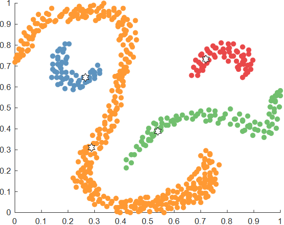 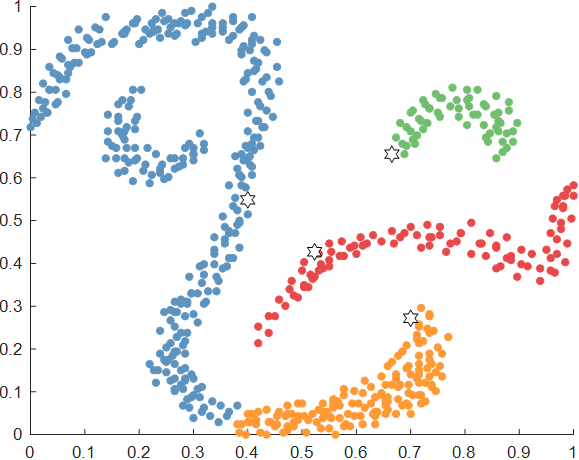

​                                          (a) MDPC                                                                               (b) IDPC-FA

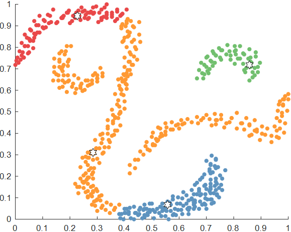 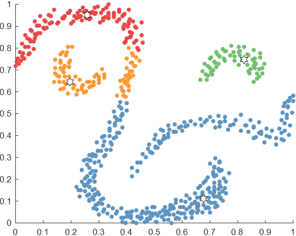

​                                          (c) DPCSA                                                                                (d) FNDPC

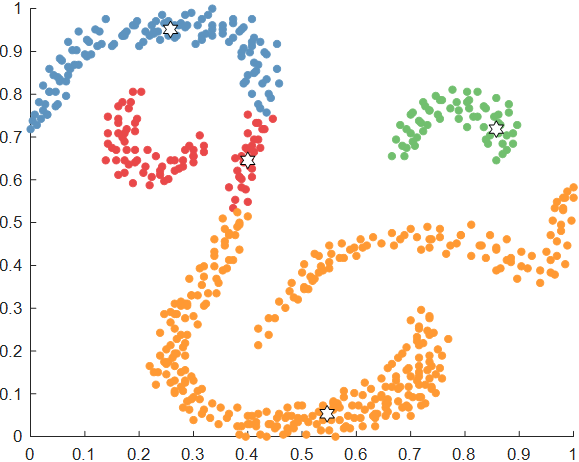 

​                                     (e) FKNN-DPC                                                                                (f) DPC

​                                                              图1 6种算法在Db数据集上的聚类结果

***

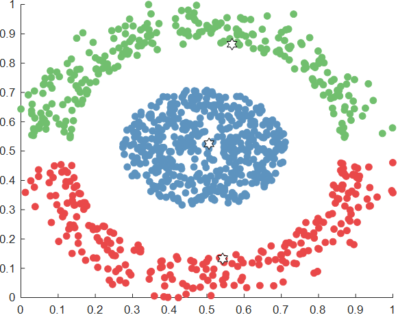 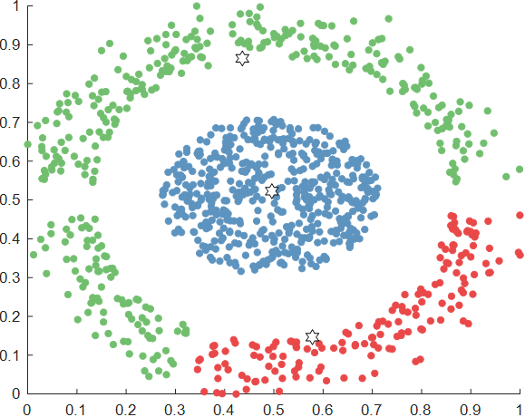

​                                          (a) MDPC                                                                               (b) IDPC-FA

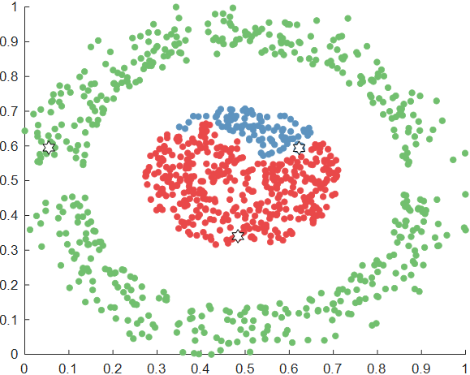 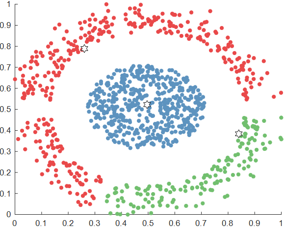

​                                          (c) DPCSA                                                                                (d) FNDPC

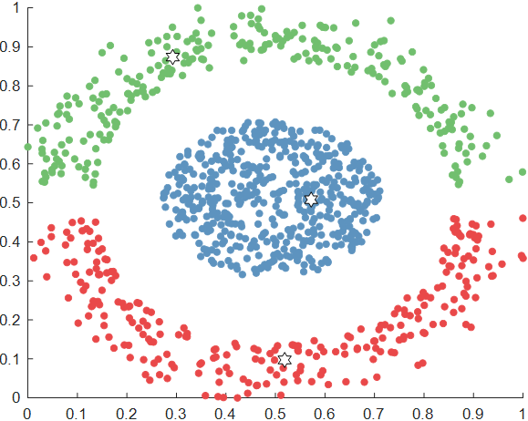 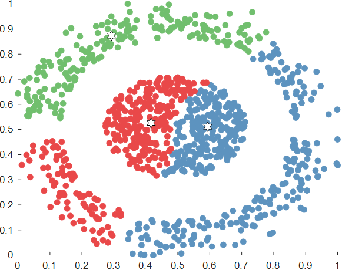

​                                     (e) FKNN-DPC                                                                                (f) DPC

​                                                             图2 6种算法在Cmc数据集上的聚类结果

***

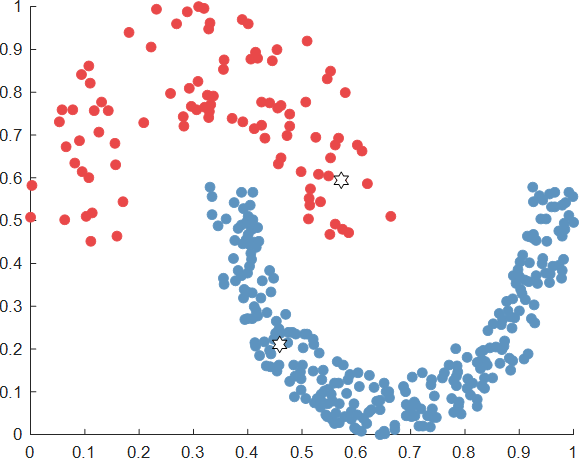 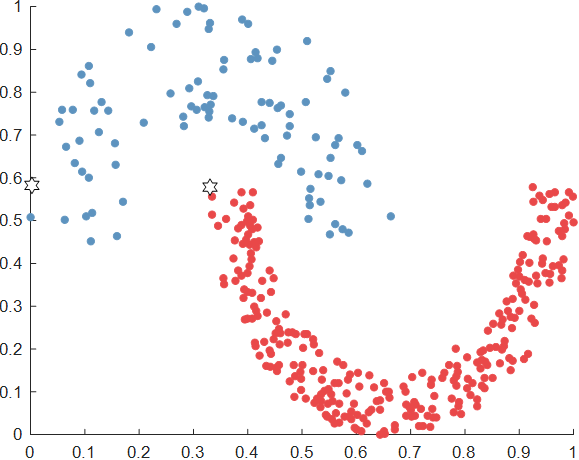

​                                          (a) MDPC                                                                               (b) IDPC-FA

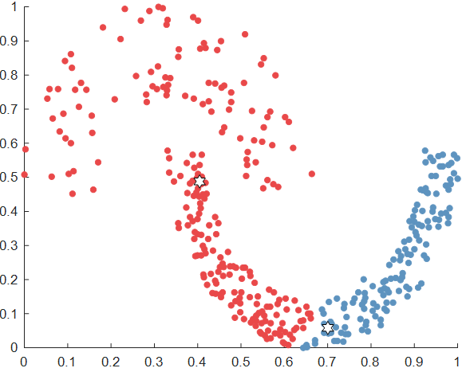 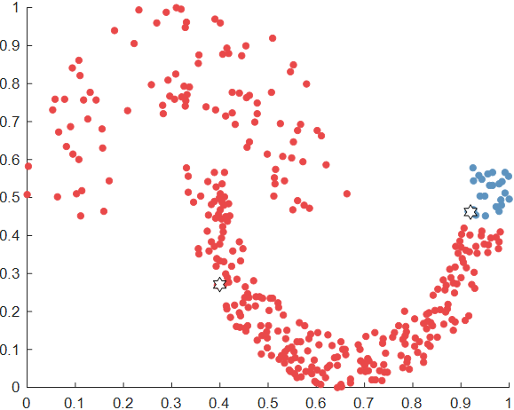

​                                          (c) DPCSA                                                                                (d) FNDPC

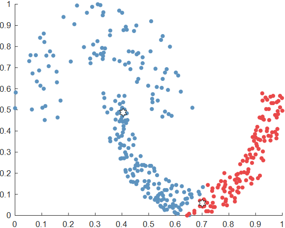 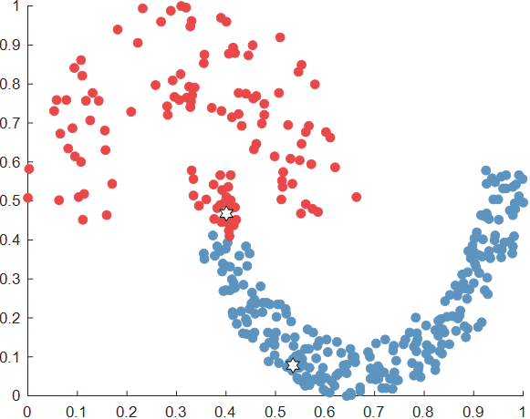

​                                     (e) FKNN-DPC                                                                                (f) DPC

​                                                             图3 6种算法在Jain数据集上的聚类结果

***

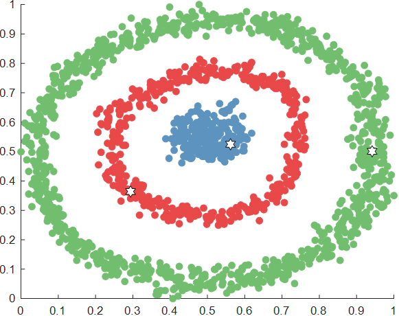 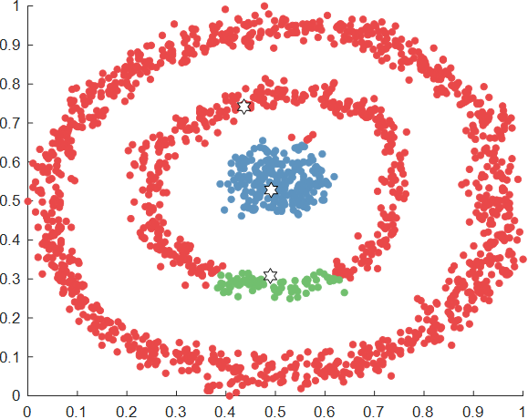

​                                          (a) MDPC                                                                               (b) IDPC-FA

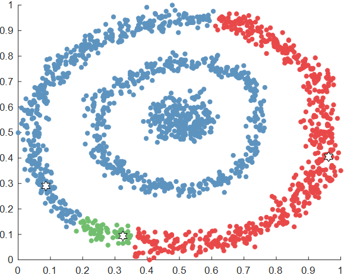 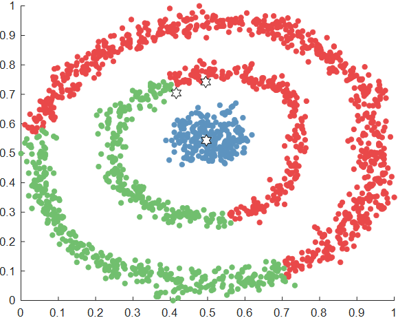

​                                          (c) DPCSA                                                                                (d) FNDPC

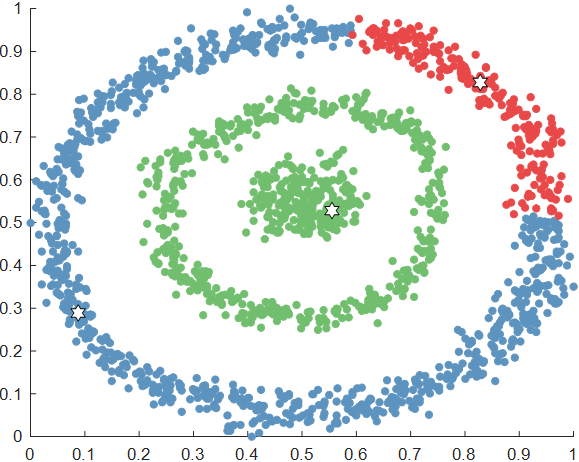 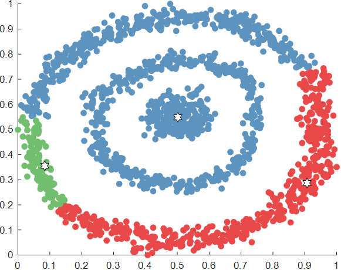

​                                     (e) FKNN-DPC                                                                                (f) DPC

​                                                             图4 6种算法在Circle数据集上的聚类结果

***

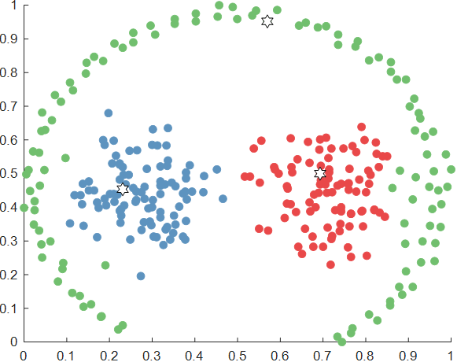 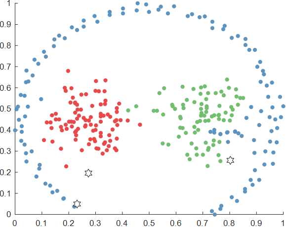

​                                          (a) MDPC                                                                               (b) IDPC-FA

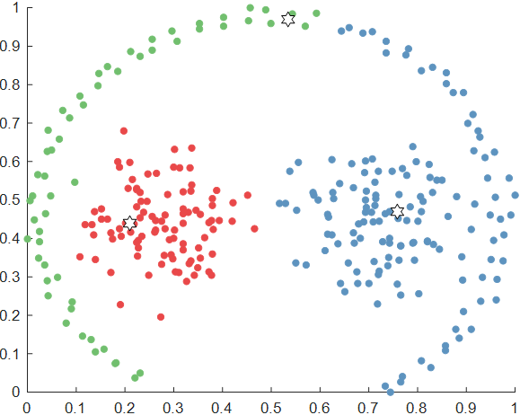 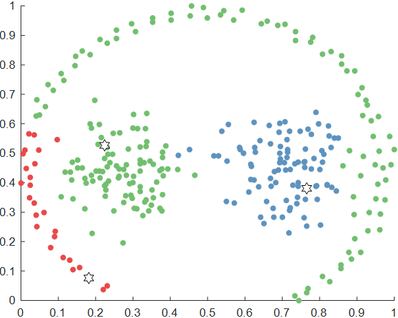

​                                          (c) DPCSA                                                                                (d) FNDPC

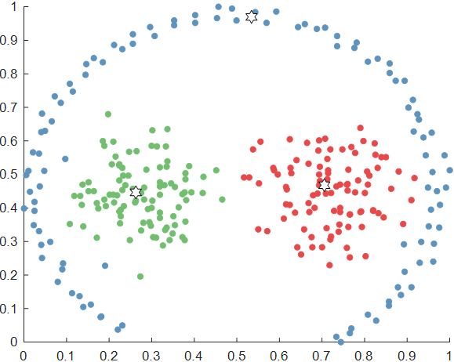 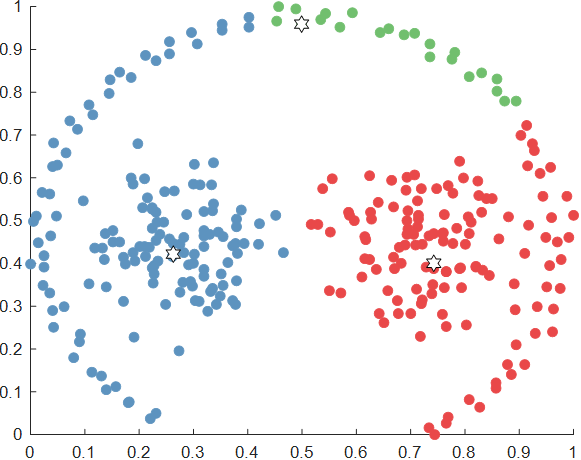

​                                     (e) FKNN-DPC                                                                                (f) DPC

​                                                             图5 6种算法在Pathbased数据集上的聚类结果

***

## 真实数据集的实验结果

​		为了进一步证明MDPC的可用性，使用MDPC算法与IDPC-FA、DPCSA、FNDPC、FKNN-DPC、DPC算法对UCI中8个真实数据集Ecoli、Ionosphere、Iris、Libras、Seeds、Segmentation、Wdbc、Wine进行聚类，这些数据集的信息可以从表2得知。聚类效果如表4所示。

​                                                         表4 6种算法在UCI中8个真实数据集的聚类效果比较

| Algorithms | AMI        | ARI        | FMI        | Arg- | Algorithms | AMI          | ARI        | FMI        | Arg- |
| ---------- | ---------- | ---------- | ---------- | ---- | ---------- | ------------ | ---------- | ---------- | ---- |
|            | Ecoli      |            |            |      |            | Seeds        |            |            |      |
| MDPC       | 0.6522     | 0.7368     | 0.8160     | 20   | MDPC       | 0.7483       | 0.7992     | 0.8655     | 7    |
| IDPC-FA    | **0.6640** | **0.7561** | **0.8280** | -    | IDPC-FA    | 0.7299       | 0.750      | 0.8444     | -    |
| DPCSA      | 0.4406     | 0.4593     | 0.6450     | -    | DPCSA      | 0.6609       | 0.6873     | 0.7918     | -    |
| FNDPC      | 0.4833     | 0.5618     | 0.7178     | 0.35 | FNDPC      | 0.7136       | 0.7545     | 0.8361     | 0.07 |
| FKNN-DPC   | 0.5878     | 0.5894     | 0.7027     | 2    | FKNN-DPC   | **0.7757**   | **0.8024** | **0.8682** | 9    |
| DPC        | 0.4978     | 0.4465     | 0.5775     | 0.4  | DPC        | 0.7299       | 0.750      | 0.8444     | 0.7  |
|            | Ionosphere |            |            |      |            | Segmentation |            |            |      |
| MDPC       | **0.4125** | **0.5356** | **0.8020** | 32   | MDPC       | 0.6869       | 0.6296     | 0.6812     | 10   |
| IDPC-FA    | 0.1355     | 0.2183     | 0.6432     | -    | IDPC-FA    | **0.7179**   | **0.6493** | **0.6982** | -    |
| DPCSA      | 0.1335     | 0.2135     | 0.6390     | -    | DPCSA      | 0.5130       | 0.3650     | 0.4887     | -    |
| FNDPC      | 0.1630     | 0.2483     | 0.6531     | 0.06 | FNDPC      | 0.7176       | 0.6338     | 0.6859     | 0.19 |
| FKNN-DPC   | 0.3485     | 0.4790     | 0.7716     | 8    | FKNN-DPC   | 0.6013       | 0.4780     | 0.5695     | 8    |
| DPC        | 0.1376     | 0.2231     | 0.6476     | 0.4  | DPC        | 0.6927       | 0.6004     | 0.5030     | 1.5  |
|            | Iris       |            |            |      |            | Wdbc         |            |            |      |
| MDPC       | **0.8831** | **0.9038** | **0.9355** | 7    | MDPC       | **0.7101**   | **0.8113** | **0.9137** | 61   |
| IDPC-FA    | 0.8623     | 0.8857     | 0.9233     | -    | IDPC-FA    | 0.6237       | 0.7423     | 0.8829     | -    |
| DPCSA      | **0.8831** | **0.9038** | **0.9355** | -    | DPCSA      | 0.3361       | 0.3771     | 0.7595     | -    |
| FNDPC      | **0.8831** | **0.9038** | **0.9355** | 0.11 | FNDPC      | 0.6076       | 0.3645     | 0.8758     | 0.05 |
| FKNN-DPC   | **0.8831** | **0.9038** | **0.9355** | 22   | FKNN-DPC   | 0.6423       | 0.7613     | 0.8894     | 2    |
| DPC        | 0.8606     | 0.8857     | 0.9233     | 0.2  | DPC        | 0.4366       | 0.4964     | 0.7941     | 0.5  |
|            | Libras     |            |            |      |            | Wine         |            |            |      |
| MDPC       | **0.5822** | 0.3623     | 0.4096     | 5    | MDPC       | **0.8598**   | 0.8837     | 0.9227     | 32   |
| IDPC-FA    | 0.5733     | **0.3816** | **0.4247** | -    | IDPC-FA    | 0.7505       | 0.7713     | 0.8478     | -    |
| DPCSA      | 0.5388     | 0.3095     | 0.3791     | -    | DPCSA      | 0.7480       | 0.7414     | 0.8283     | -    |
| FNDPC      | 0.5494     | 0.3290     | 0.3869     | 0.17 | FNDPC      | 0.7898       | 0.8025     | 0.8686     | 0.26 |
| FKNN-DPC   | 0.5554     | 0.3459     | 0.4044     | 10   | FKNN-DPC   | 0.8481       | **0.8839** | **0.9229** | 8    |
| DPC        | 0.5358     | 0.3193     | 0.3717     | 0.3  | DPC        | 0.7065       | 0.5024     | 0.7835     | 2    |

## 其他数据集的实验结果

​		使用MDPC算法与IDPC-FA、DPCSA、FNDPC、FKNN-DPC、DPC算法对4个较大规模的复杂数据集进行聚类。表5是这个数据集的基本信息。

​                                                                                  表5 复杂数据集

| 数据集   | 样本数 | 维度 | 簇数 |
|----------|--------|------|------|
| Cth      | 1016   | 2    | 3    |
| Ls       | 1741   | 2    | 6    |
| Ring     | 1000   | 2    | 2    |
| Twomoons | 1502   | 2    | 6    |

​                                                               表6 6种算法在数据集的聚类效果比较

| Algorithms | AMI      | ARI    | FMI    | Arg- | Algorithms | AMI    | ARI    | FMI    | Arg- |
|------------|----------|--------|--------|------|------------|--------|--------|--------|------|
| Cth        | Ring     |        |        |      |            |        |        |        |      |
| MDPC       | **1**    | **1**  | **1**  | 17   | MDPC       | **1**  | **1**  | **1**  | 21   |
| IDPC-FA    | 0.8758   | 0.8327 | 0.8786 | -    | IDPC-FA    | **1**  | **1**  | **1**  | -    |
| DPCSA      | 0.7891   | 0.6538 | 0.7547 | -    | DPCSA      | **1**  | **1**  | **1**  | -    |
| FNDPC      | 0.8758   | 0.8327 | 0.8786 | 0.45 | FNDPC      | 0.5508 | 0.5651 | 0.7892 | 0.47 |
| FKNN-DPC   | **1**    | **1**  | **1**  | 22   | FKNN-DPC   | **1**  | **1**  | **1**  | 6    |
| DPC        | 0.6866   | 0.5135 | 0.6473 | 0.1  | DPC        | 0.3517 | 0.3019 | 0.6857 | 0.1  |
| Ls         | Twomoons |        |        |      |            |        |        |        |      |
| MDPC       | **1**    | **1**  | **1**  | 8    | MDPC       | **1**  | **1**  | **1**  | 2    |
| IDPC-FA    | 0.7076   | 0.6274 | 0.7325 | -    | IDPC-FA    | **1**  | **1**  | **1**  | -    |
| DPCSA      | 0.7252   | 0.5999 | 0.7129 | -    | DPCSA      | 0.3647 | 0.2746 | 0.6607 | -    |
| FNDPC      | 0.7564   | 0.6898 | 0.7808 | 0.37 | FNDPC      | **1**  | **1**  | **1**  | 0.13 |
| FKNN-DPC   | 0.8719   | 0.8179 | 0.8735 | 48   | FKNN-DPC   | 0.2807 | 0.0982 | 0.5620 | 10   |
| DPC        | 0.7665   | 0.6894 | 0.7779 | 0.9  | DPC        | 0.5225 | 0.5456 | 0.7862 | 3.8  |

从表6可以看出MDPC算法在4种复杂数据集中均进行了完美聚类，再次证明其的可用性。

***

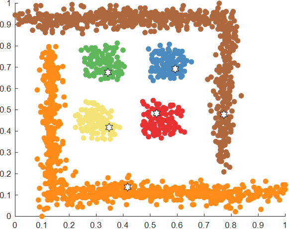 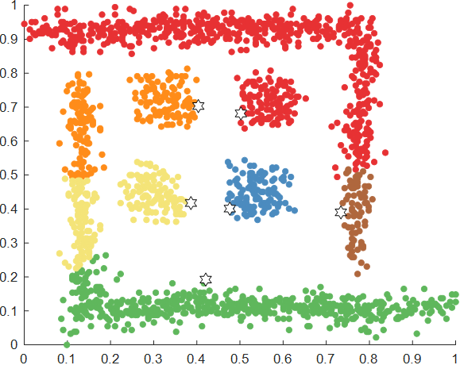

​                                          (a) MDPC                                                                               (b) IDPC-FA

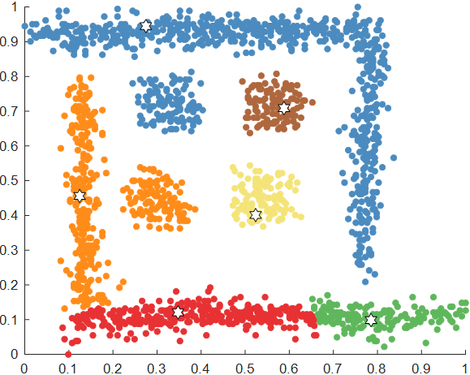 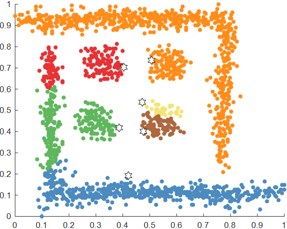

​                                          (c) DPCSA                                                                                (d) FNDPC

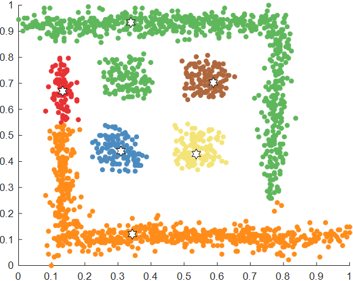 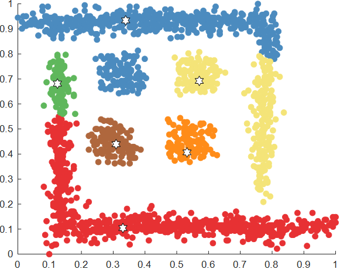

​                                     (e) FKNN-DPC                                                                                (f) DPC

​                                                                 图6 6种算法在Ls数据集上的聚类结果

***

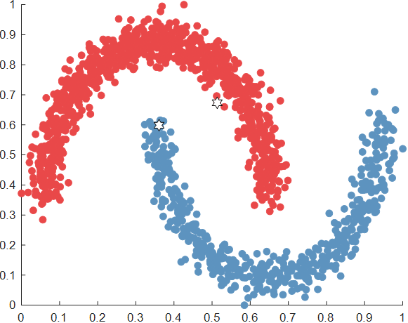 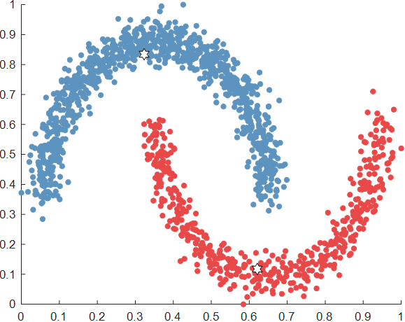

​                                          (a) MDPC                                                                               (b) IDPC-FA

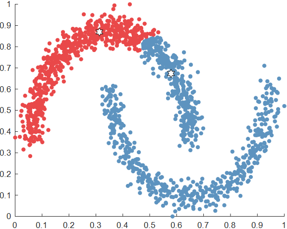 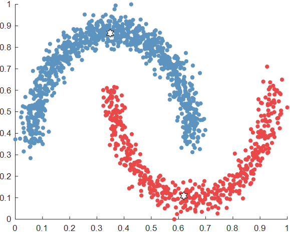

​                                          (c) DPCSA                                                                                (d) FNDPC

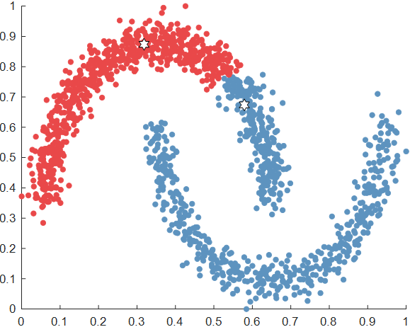 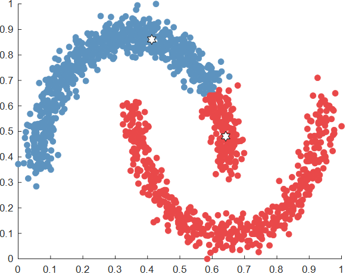

​                                     (e) FKNN-DPC                                                                                (f) DPC

​                                                         图7 6种算法在Twomoons数据集上的聚类结果

***

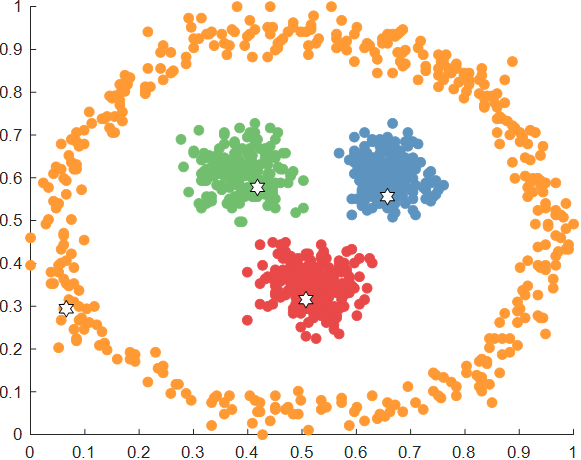 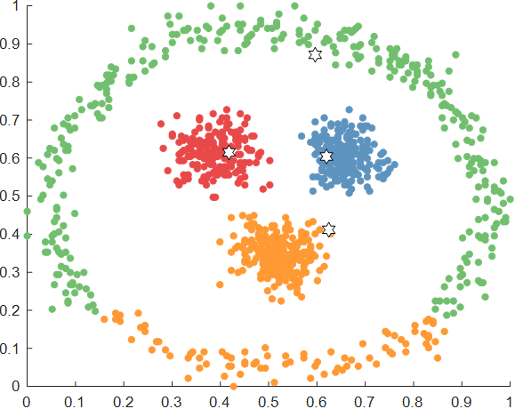

​                                          (a) MDPC                                                                               (b) IDPC-FA

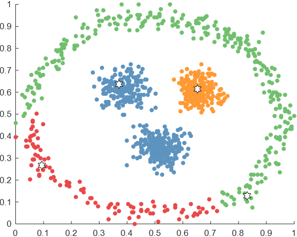 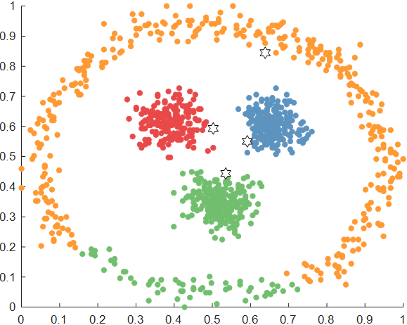

​                                          (c) DPCSA                                                                                (d) FNDPC

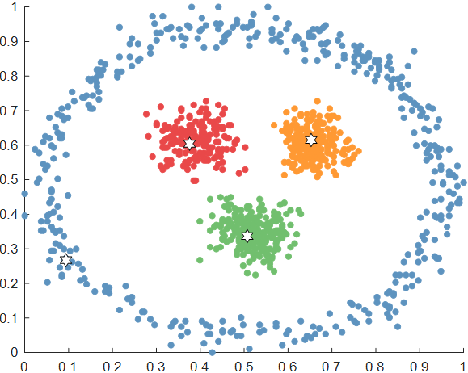 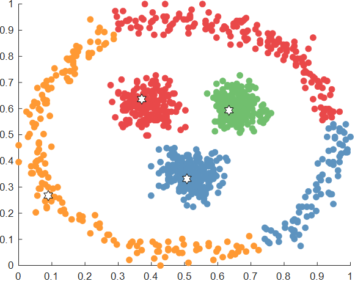

​                                     (e) FKNN-DPC                                                                                (f) DPC

​                                                                  图8 6种算法在Cth数据集上的聚类结果

***

## 参考文献

[^1]: Zhao J, Tang J J, Shi A, et al. Improved density peaks clustering based on firefly algorithm[J]. International Journal of Bio-Inspired Computation, 2020, 15(1): 24-42.
[^2]: Yu D, Liu G, Guo M, et al. Density peaks clustering based on weighted local density sequence and nearest neighbor assignment[J]. IEEE Access, 2019, 7: 34301-34317.
[^3]: Du M J, Ding S F, Xue Y. A robust density peaks clustering algorithm using fuzzy neighborhood[J]. International Journal of Machine Learning and Cybernetics, 2018,9(7):1131-1140.
[^4]: Xie J Y, Gao H C, Xie W X, et al. Robust clustering by detecting density peaks and assigning points based on fuzzy weighted K-nearest neighbors[J]. Information Sciences, 2016, 354:19-40.
[^5]: Rodriguez A, Laio A. Clustering by fast search and find of density peaks[J]. Science, 2014, 344(6191): 1492-1496.
[^6]: http://cs.joensuu.fi/sipu/datasets/
[^7]: Lichman M. UCI machine learning repository[EB/OL].http://archive.ics.uci.edu/ml. Irvine: University of California,2013.
[^8]: Vinh N, Epps J, Bailey J. Information theoretic measures for clusterings comparison: Variants, properties, normalization and correction for chance[J]. Journal of Machine Learning Research, 2010, 11(1):2837-2854.
[^9]: Fowlkes E B, Mallows C L. A Method for Comparing Two Hierarchical Clusterings[J]. Journal of the American Statistical Association, 1983, 78(383):553-569.